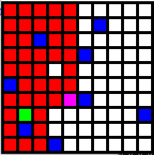

# AI-Path Finding

## Description : This project is the implementation of AI search algorithms to solve mages

## How to run?
<pre>
	<code> pip install reqirements.txt </code>
	<code> python main.py</code>
</pre>

In this project we have implemented two algorithms(A* and DFS).Feel free to implement and add more
algorithms you know.If you want to add your own fun mazes to the project write your own txt file in the format of maze.txt
Note that the window size is onl 255x255

If you want to make a custom maze and use the algorithm to solve it then you can do it in the following steps.

